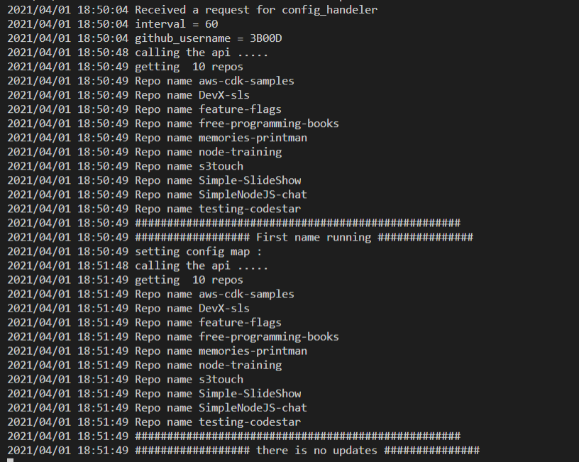

# repo_watcher
repo_watcher

## Deployment

To deploy to kubernetes : 


Checkout the repository and run 

```
helm install repo-watcher ./repo-watcher/ --set service.type=NodePort
```
or 

```
make install
```


to Authrize the pod access the default namespace 
```
make auth
```

## Screens 

Pod logs 


no updates 


new repo 


changing github username 


